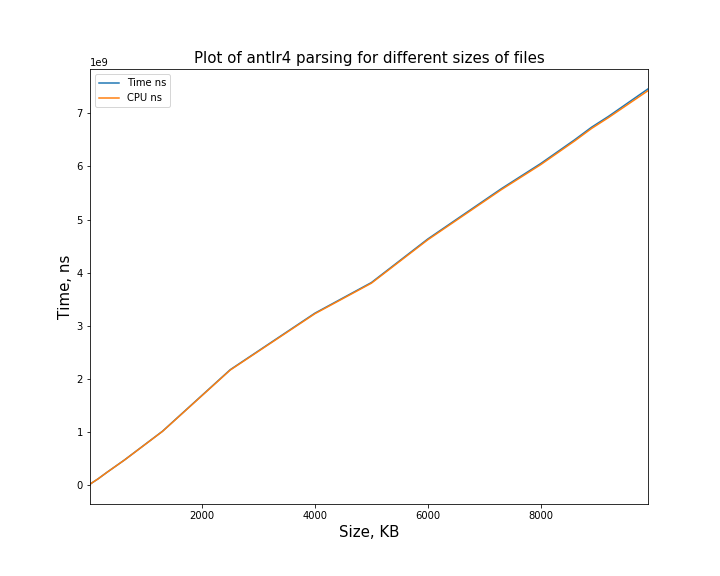
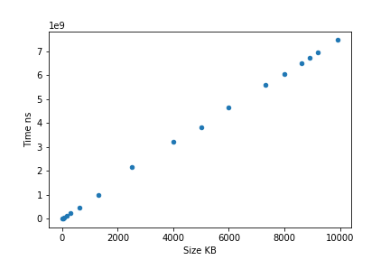
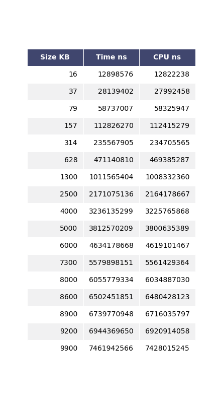
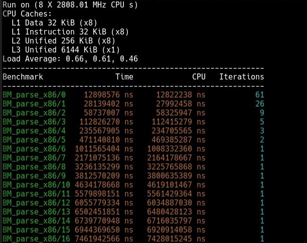

# x86_antlr4

## Реализовать проверку корректности синтаксиса подмножества ассемблера x86 в синтаксисе Intel с помощью antlr4

### Поддерживает: 

* Проверяет, что каждая строка: имя метки с двоеточием и/или одна инструкция из мнемоники и аргументов через запятую.
* Проверяет для каждой инструкции правильное число и вид аргументов, соответствие ширин операндов для двухоперандных инструкций и наличие используемых меток.
* Для аргументов формы: регистры общего назначения (32 бита и все части вплоть до 8 бит).
* Для аргументов формы: непосредственное значение в виде целочисленной шестнадцатиричной константы записанной через 0x или h.
* Для аргументов формы: косвенную выборку любой сложности, вплоть до [регистр + 1/2/4/8 * регистр + смещение] с указанием размера выборки (byte/word/dword/qword ptr).

## Синтаксис инструкций:

### Binary instructions (add, mov, sub, or, and, xor, cmp, test):

* cmd <reg8/16/32>,<reg8/16/32>
* cmd <reg8/16/32>,<mem8/16/32>
* cmd <mem8/16/32>,<reg8/16/32>
* cmd <reg8/16/32>,<const8/16/32>
* cmd <mem8/16/32>,<const8/16/32>

### Unary instructions (neg, not, div, inc, dec, mul, pop):

* cmd <reg8/16/32>
* cmd <mem8/16/32>

### Control flow instructions (call, jmp, jne, je, jz):

* cmd label
* cmd <reg32>/<mem32>/<imm32>
  
### Push instruction:

* push <reg32>/<mem32>/<imm32>
* push <reg16>/<mem16>

### Ret instruction:

* ret
* ret <imm16>

### Nop инструкция:

* Nop

 
  
 

